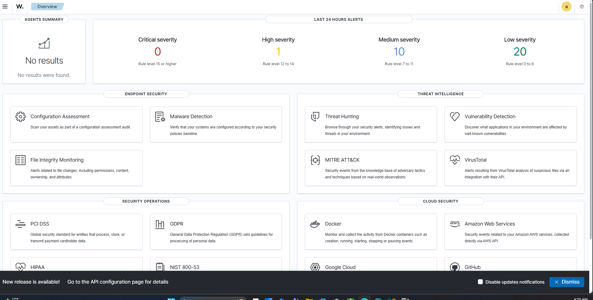
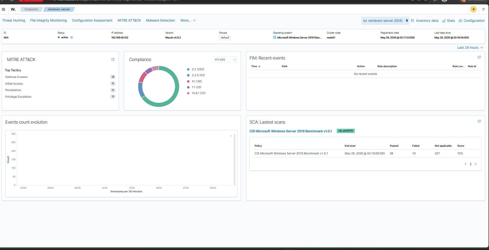
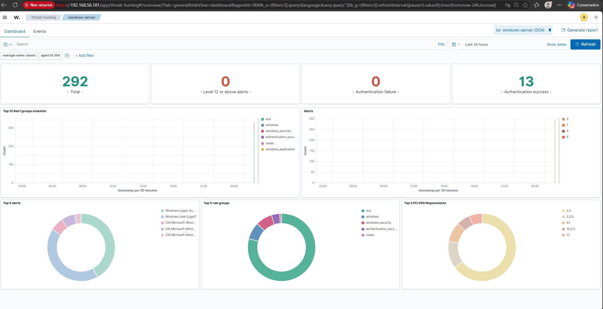
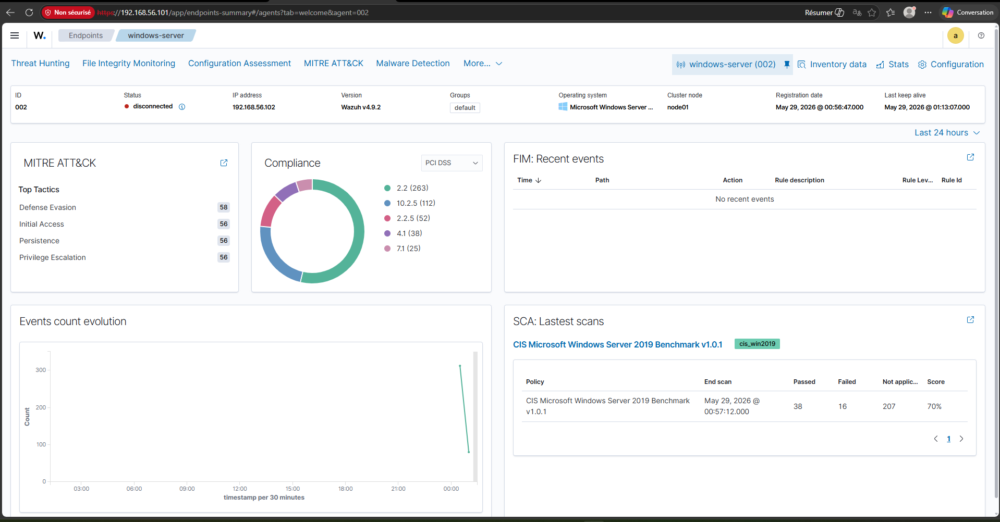
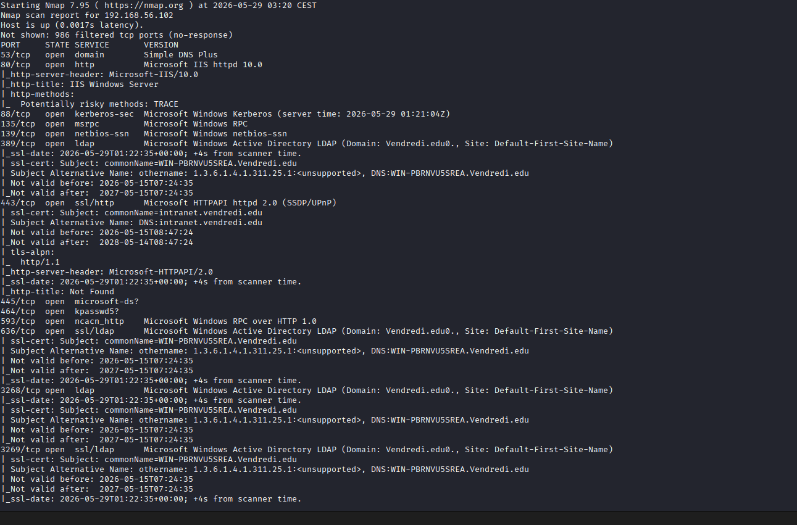

# 🔐 SOC Blue Team Home Lab — Wazuh SIEM


> A fully functional SOC (Security Operations Center) home lab built from scratch to practice real-world threat detection, log analysis, and incident response using Wazuh SIEM, a Windows Server 2019 target, and Kali Linux as the attacker machine.

---

## 📋 Table of Contents

- [Architecture](#-architecture)
- [Tech Stack](#-tech-stack)
- [Lab Setup](#-lab-setup)
- [Attack Simulations](#-attack-simulations)
- [Detection Results](#-detection-results)
- [MITRE ATT&CK Mapping](#-mitre-attck-mapping)
- [CIS Benchmark](#-cis-benchmark)
- [Screenshots](#-screenshots)
- [Skills Demonstrated](#-skills-demonstrated)
- [What I Learned](#-what-i-learned)

---

## 🏗 Architecture

```
┌─────────────────────────────────────────────────────────┐
│                    VirtualBox Host-Only Network          │
│                      192.168.56.0/24                     │
│                                                          │
│  ┌──────────────┐   ┌──────────────┐  ┌──────────────┐  │
│  │  Wazuh SIEM  │   │ Windows Srv  │  │ Kali Linux   │  │
│  │  Ubuntu 24   │   │    2019      │  │  Attacker    │  │
│  │ .56.101      │◄──│ .56.102      │  │ .56.103      │  │
│  │              │   │ Wazuh Agent  │  │              │  │
│  │ Manager      │   │ AD Domain:   │  │ Nmap         │  │
│  │ Indexer      │   │ Vendredi.edu │  │ Hydra        │  │
│  │ Dashboard    │   │              │  │ Scripts      │  │
│  └──────────────┘   └──────────────┘  └──────────────┘  │
└─────────────────────────────────────────────────────────┘
```

| Machine | Role | OS | IP |
|---|---|---|---|
| Wazuh Server | SIEM Manager + Dashboard | Ubuntu Server 24.04 LTS | 192.168.56.101 |
| Windows Server | Target (Wazuh Agent) | Windows Server 2019 Standard | 192.168.56.102 |
| Kali Linux | Attacker | Kali Linux 2024.x | 192.168.56.103 |

---

## 🛠 Tech Stack

| Category | Tools |
|---|---|
| SIEM | Wazuh 4.9.2 (Manager + Indexer + Dashboard) |
| Target OS | Windows Server 2019 — Active Directory (Domain: Vendredi.edu) |
| Attacker OS | Kali Linux |
| Virtualization | VirtualBox — Host-Only Network |
| Threat Framework | MITRE ATT&CK |
| Compliance | CIS Benchmark · PCI DSS · NIST 800-53 · HIPAA |
| Attack Tools | Nmap · Hydra |

---

## ⚙️ Lab Setup

### Prerequisites
- VirtualBox 7.x
- 8 GB RAM minimum on host machine (16 GB recommended)
- Ubuntu Server 24.04 LTS ISO
- Windows Server 2019 ISO
- Kali Linux ISO

### Network Configuration
All VMs use two network adapters:
- **Adapter 1**: NAT (internet access for packages)
- **Adapter 2**: Host-Only `vboxnet0` (192.168.56.0/24) — internal lab communication

### Wazuh Installation (Ubuntu Server)

```bash
# Download and run the all-in-one installer
wget -O wazuh-install.sh https://packages.wazuh.com/4.9/wazuh-install.sh
sudo bash wazuh-install.sh -a
```

Access dashboard at: `https://192.168.56.101`

### Wazuh Agent (Windows Server 2019)

```powershell
# Install agent pointing to Wazuh Manager
msiexec.exe /i wazuh-agent-4.9.2-1.msi WAZUH_MANAGER='192.168.56.101' WAZUH_AGENT_NAME='windows-server'
NET START WazuhSvc
```

---

## ⚔️ Attack Simulations

### 1. Nmap Service & OS Detection Scan

```bash
nmap -sV -O 192.168.56.102
```

**Results:**
- OS detected: **Windows Server 2019** (97% confidence)
- 15+ open ports: 53 (DNS), 80 (IIS 10.0), 88 (Kerberos), 135 (RPC), 139, 389 (LDAP), 443, 445, 3268/3269 (Global Catalog)
- Domain: `Vendredi.edu` (Active Directory)

### 2. Aggressive Nmap Scan with Scripts

```bash
nmap -A -T4 --script=auth 192.168.56.102
```

**Results:**
- SSL certificates extracted (CommonName: WIN-PBRNVU5SREA.Vendredi.edu)
- HTTP methods enumerated on IIS 10.0 (TRACE method detected — potential risk)
- WinRM port 5985 discovered (WSMan)
- 365+ alerts generated in Wazuh in real-time

---

## 📊 Detection Results

| Severity | Count | Rule Level |
|---|---|---|
| Critical | 0 | Level 15+ |
| High | 1 | Level 12–14 |
| Medium | 40 | Level 7–11 |
| Low | 767 | Level 0–6 |
| **Total** | **808+** | |

**Top Alert Categories:**
- Windows Logon Success / Failure
- SCA (Security Configuration Assessment)
- windows_security
- authentication_success
- windows_application

---

## 🎯 MITRE ATT&CK Mapping

Wazuh automatically mapped detected events to MITRE ATT&CK tactics:

| Tactic | Count | Description |
|---|---|---|
| Defense Evasion | 58 | Attempts to avoid detection |
| Initial Access | 56 | Gaining entry into the network |
| Persistence | 56 | Maintaining foothold |
| Privilege Escalation | 56 | Gaining higher-level permissions |

---

## 🛡 CIS Benchmark

Wazuh ran an automated **CIS Microsoft Windows Server 2019 Benchmark v1.0.1** assessment:

| Metric | Value |
|---|---|
| Score | **70%** |
| Passed | 38 checks |
| Failed | 16 checks |
| Not Applicable | 207 checks |

The 16 failed checks represent real security misconfigurations that would be remediated in a production environment (e.g., password policies, audit settings, SMB signing).

---

## 📸 Screenshots

### Wazuh Dashboard — Overview


### Agent Active — Windows Server 2019


### Threat Hunting — 365 Alerts


### MITRE ATT&CK + CIS Benchmark


### Nmap Scan from Kali


---

## 💡 Skills Demonstrated

- **SIEM Configuration**: Deployed Wazuh All-in-One stack (Manager + OpenSearch + Dashboard) on Ubuntu Server
- **Agent Enrollment**: Configured and registered a Windows Server 2019 Wazuh agent with authentication key management
- **Network Security**: Isolated lab network design with VirtualBox Host-Only adapters and dual NAT/Host-Only configuration
- **Threat Detection**: Real-time correlation of attack activity with 800+ alerts generated and categorized by severity
- **MITRE ATT&CK**: Interpreted automated TTP mapping across 4 attack tactics from a single Nmap scan
- **Compliance Assessment**: Analyzed CIS Benchmark results and identified 16 security misconfigurations on Windows Server 2019
- **Offensive Recon**: Conducted service enumeration, OS fingerprinting, and SSL certificate extraction with Nmap

---

## 📚 What I Learned

1. **Wazuh vs Splunk**: Unlike Splunk (which I already use), Wazuh provides built-in agent-based endpoint monitoring with native MITRE ATT&CK and CIS Benchmark integration — no additional plugins needed.

2. **Active Directory as an attack surface**: A single Nmap scan on a Windows Server running AD exposes significant information (domain name, certificate details, service versions) that an attacker can leverage for further attacks.

3. **Alert triage**: Not every alert is critical. Learning to filter by severity level and rule group is the core skill of a SOC analyst — 767 low-severity alerts vs. 1 high-severity alert tells a very different story.

4. **CIS Benchmarks in practice**: A 70% score on a freshly installed Windows Server 2019 is realistic — most default configurations are insecure out of the box.

5. **Network segmentation matters**: Isolating the attacker machine from the internet while keeping it on the same internal segment as the target simulates real-world lateral movement scenarios.

---

## 🔗 Connect

- **LinkedIn**: [linkedin.com/in/firas-ben-katib-cybersecurity](https://linkedin.com/in/firas-ben-katib-cybersecurity)
- **GitHub**: [github.com/FIRASKTIB](https://github.com/FIRASKTIB)
- **Email**: firasbenkatib21@gmail.com


